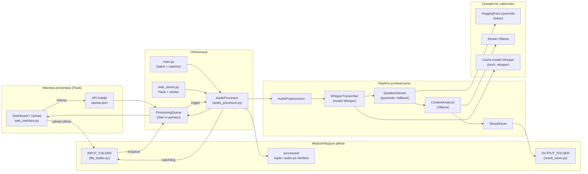

Oto przykładowy diagram architektoniczny w formacie Mermaid. Pokazuje kierunki przepływu między głównymi komponentami Whisper Analyzer:

**Jak czytać diagram:**
- Interfejs webowy (dashboard, API kolejki) komunikuje się z lokalną kolejką i folderem wejściowym; backend uruchamia `AudioProcessor`, który steruje pipeline’em przetwarzania audio.
- `AudioProcessor` odpowiada za cały przebieg: od pobrania pliku z `INPUT_FOLDER`, przez preprocessing i transkrypcję, po zapis wyników i aktualizację statusów.
- Moduły transkrypcji, diarization i analizy treści współpracują z zewnętrznymi usługami/modelami (Whisper cache, Hugging Face, Ollama).
- Wyniki trafiają do `OUTPUT_FOLDER` (pliki tekstowe) oraz `processed/` (kopie audio), a kolejka przekazuje referencje do interfejsu webowego.
